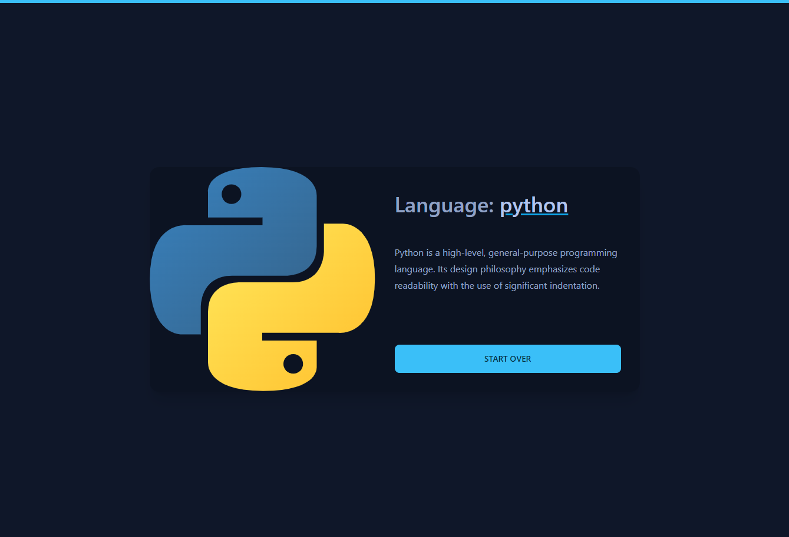

# Project Setup Guide

## Overview
An [Expert System](https://en.wikipedia.org/wiki/Expert_system) that suggests the most suitable programming language based on your interests and preferences.

The system is built with [Laravel](https://laravel.com/), [Livewire](https://laravel-livewire.com/), [FastAPI](https://fastapi.tiangolo.com/), and [Experta](https://experta.readthedocs.io/en/latest/thebasics.html).


> Another screenshot [here](imgs/app_2.png).

## Manual Setup
> You can avoid this configurational step by using the [Docker installation process](#docker-setup).

Before setting up the project, make sure you have the required dependencies:
- **Python >= 3.9**
- **PHP >= 8.0**
- **pip**
- **composer**
- **npm**

### Installing Dependencies
>The following example works for Debian Based Linux Distributions.

Update the system
```bash
sudo apt update && sudo apt upgrade -y
```
Install Python
```bash
sudo add-apt-repository ppa:deadsnakes/ppa
sudo apt install python3.9
```

Install pip
```bash
sudo apt install python3-pip
```

Install PHP
```bash
sudo apt get install -y php8.1-cli php8.1-common php8.1-mysql php8.1-zip php8.1-gd php8.1-mbstring php8.1-curl php8.1-xml php8.1-bcmath
```

Install composer
```bash
curl -sS https://getcomposer.org/installer -o /tmp/composer-setup.php

sudo php /tmp/composer-setup.php --install-dir=/usr/local/bin --filename=composer
```

Install npm
```bash
sudo apt install nodejs npm
```

### Setting the Web Application
Make sure you are in the `web-app` directory
```bash
cd src/web-app
```

Install composer dependencies
```bash
composer install
```

Install npm dependencies and build the assets
```bash
npm install
npm run build
```

Create the `.env` file and generate the application encryption key
```bash
cp .env.example .env
php artisan key:generate
```

Update the `package.json` file by swapping the `scripts` section with the one below
```json
"scripts": {
    "dev": "vite",
    "build": "vite build"
},
```
Update the `expert.php` config file
```php
'endpoint' => 'http://localhost:5500/detect',
```
### Setting the Expert System

Install all the requirements
```bash
pip install --no-cache-dir --upgrade -r dockerfiles/expert-system/requirements.txt
```

### Running the project

Start the expert system
```bash
python main.py
```
Start the built-in web server
```bash
php artisan serve
```

You can now access the server at [http://localhost:8000](http://localhost:8000).


## Docker Setup
>Make sure Docker is installed.

>If you are using a Windows 10/11, you need to know that Windows uses WSL (Windows Subsystem for Linux), which is a layer between Windows and Linux, this makes Docker slow and browser requests may take 30-60 seconds to be completed.

Spin up the containers
```bash
docker-compose up -d --build app
```

Running the command will expose 3 services with the following ports:
- **Nginx** - `:80`
- **PHP** - `:9000`
- **FastAPI** - `:5500`

Install composer dependencies
```bash
docker-compose run --rm composer install
```

Install npm dependencies and build the assets
```bash
docker-compose run --rm npm install
docker-compose run --rm --service-ports npm run build
```

Create the `.env` file and generate the application encryption key
```bash
cp .env.example .env
docker-compose run --rm php artisan key:generate
```

You can now access the server at [http://localhost](http://localhost).

## Configuration
### Add Questions
You can add questions to help get better results by editing the `src/web-app/questions.json` file.

A question is a json object that has two fields:
- `"question"`: The question displayed to the user.
- `"fact"`: The information sent to the system to reason about the problem in case the user answers with "yes".
```json
"18": {
    "question": "You want to code to build websites?",
    "fact": "web"
}
```
### Add Languages
You can add new languages to be displayed to the user as a result by editing the `src/web-app/languages.json` file. 
>Make sure you have a rule that leads to the newly defined language using the facts you have, otherwise it will never be displayed, to do so, edit the `src/expert-system/expert.py` and follow the docs [here](https://experta.readthedocs.io/en/latest/thebasics.html#rules).

A language is a json object that has three fields:
- `"logo"`: The filename of the language's logo placed in `src/web-app/resources/images`.
- `"description"`: A brief description about the language.
- `"infos"`: A link for more insightful information about the language.
```json
"c/c++": {
    "logo": "c-logo.png",
    "description": "C++ is a powerful general-purpose programming language. It can be used to develop operating systems, browsers, games, and so on.",
    "infos": "https://www.programiz.com/cpp-programming"
}
```